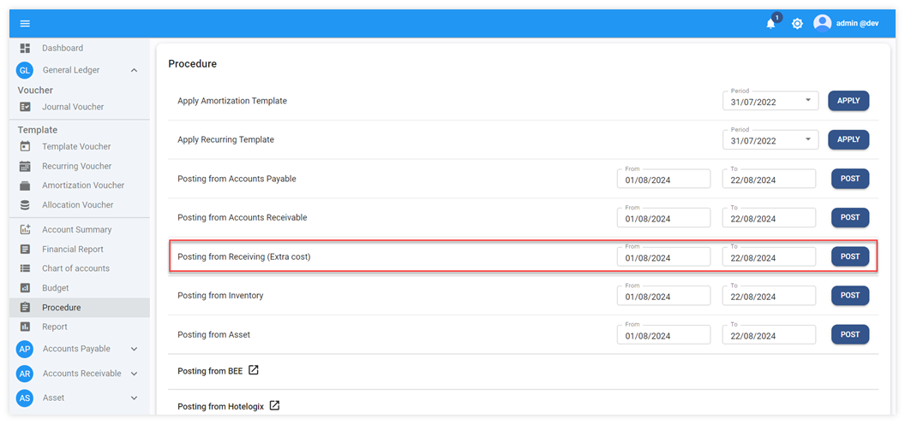
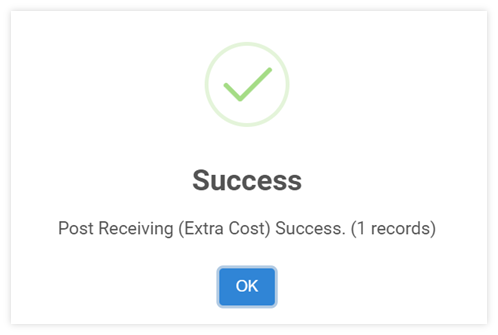
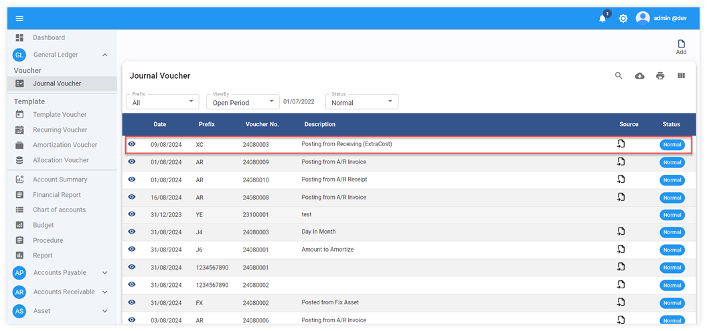
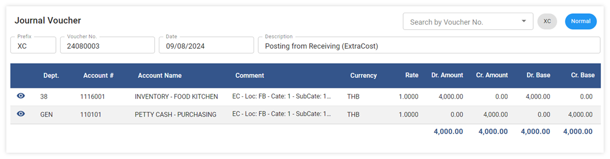
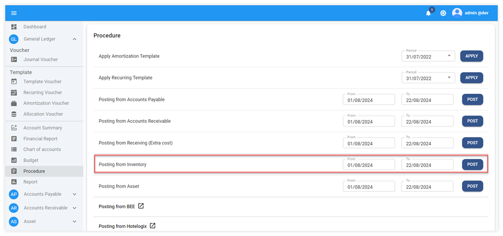
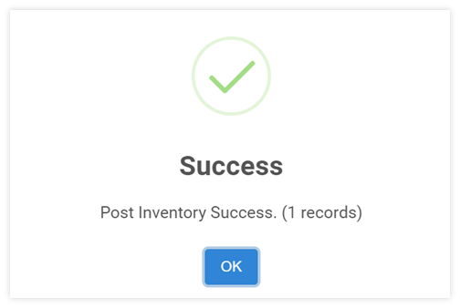
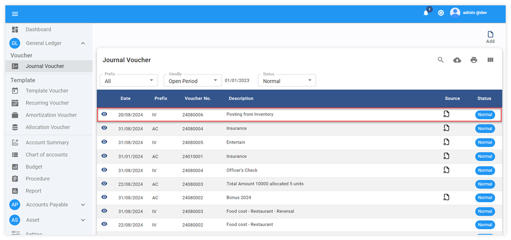
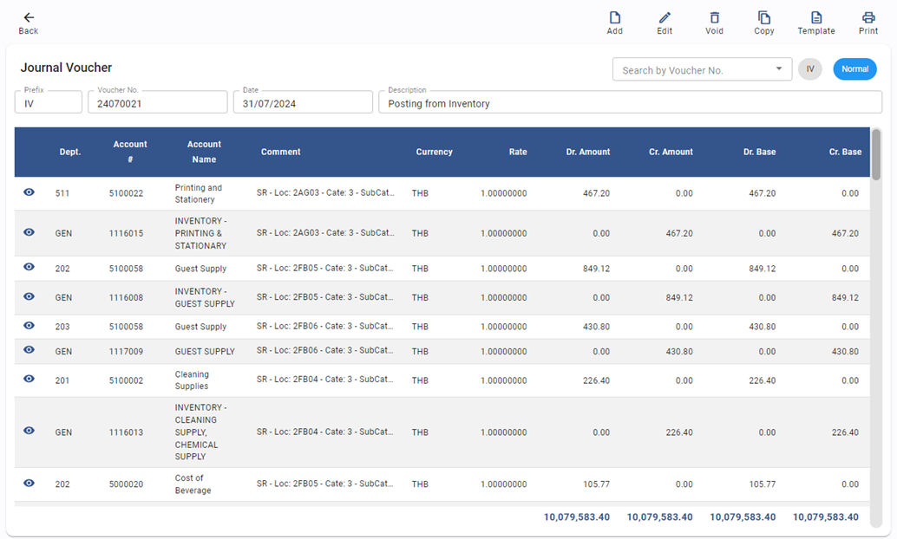
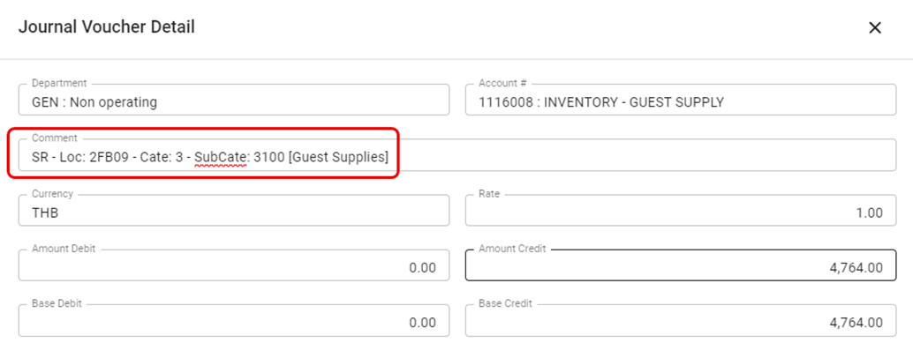

# Inventory & Extra Cost Posting to GL

การบันทึกข้อมูลต้นทุนขาย (COGS) หรือ ค่าใช้จ่ายที่มีการเบิก หรือ ปรับปรุง Stock จาก Inventory โดยยกตัวอย่างการ interface กับ ระบบ BlueLedgers

## การ Post ข้อมูล Extra cost มาบันทึกบัญชีที่ GL

- คลิกเข้าสู่ General Ledger Module
- เลือกฟังก์ชัน Procedure
- ไปที่ Posting from Inventory มีให้เลือก 2 Option ได้แก่

1. **Posting from Receiving (Extra Cost)** กรณีต้องการดึงข้อมูล Receiving Extra Cost

   1.1 กำหนดวันที่ที่ต้องการดึงข้อมูลได้จากช่อง From – To

   1.2 กด **POST** เพื่อให้ระบบดึงข้อมูลมาบันทึกบัญชีใน GL

1.3 เมื่อระบบทำการดึงข้อมูลเรียบร้อยแล้วจะขึ้นหน้าต่างแสดงข้อความ Post Receiving (Extra Cost) Success. และแจ้งจำนวน JV ที่ถูกโพตเข้าไปในระบบ ตัวอย่างตามภาพด้านล่าง

    

1.4 การตรวจสอบข้อมูลหลังจากทำการ Posting from Receiving (Extra Cost)

• Click General Ledger Module

• Click Journal Voucher

    ตัวอย่างการบันทึกบัญชีใน Extra Cost

## การ Post ข้อมูลต้นทุนและการปรับปรุงสินค้า มาบันทึกบัญชีที่ GL

2. Posting from Inventory กรณีต้องการดึงข้อมูล ค่าใช้จ่ายจาก Inventory

2.1 กำหนดวันที่ที่ต้องการดึงข้อมูลได้จากช่อง From – To

2.2 กด **POST** เพื่อให้ระบบดึงข้อมูลมาบันทึกบัญชีใน GL

2.3 เมื่อระบบทำการดึงข้อมูลเรียบร้อยแล้วจะขึ้นหน้าต่างแสดงข้อความ Post Inventory Success. และแจ้งจำนวน JV ที่ถูกโพตเข้าไปในระบบ ตัวอย่างตามภาพด้านล่าง

    

2.4 การตรวจสอบข้อมูลหลังจากทำการ Posting from Inventory

• Click General Ledger Module

• Click Journal Voucher

    ตัวอย่างการบันทึกบัญชีใน Inventory (ประเภทรายการ Store Requisition)

รายละเอียดคำอธิบายของข้อมูลจาก Inventory posting (Journal Voucher Detail)

คำอธิบายเพิ่มเติมในส่วนของ Journal Detail Comment ของ Inventory

SR - Loc: 2FB09 - Cate: 3 - SubCate: 3100 [Guest Supplies]

SR = Momement type SR: คือ รหัส movement type จาก BlueLedgers

Loc = Location Code Loc: 2FB09 คือ รหัส Location ผู้เบิก หรือ ใช้ cost ดังกล่าว

Cate = Category Code Cate: 3 คือ รหัส Category ของสินค้าที่ถูกใช้

SubCate = Item Group code SubCate: 3100 คือ รหัส Item Group ของสินค้าที่ถูกใช้ ตามด้วย Description ของ Item group

