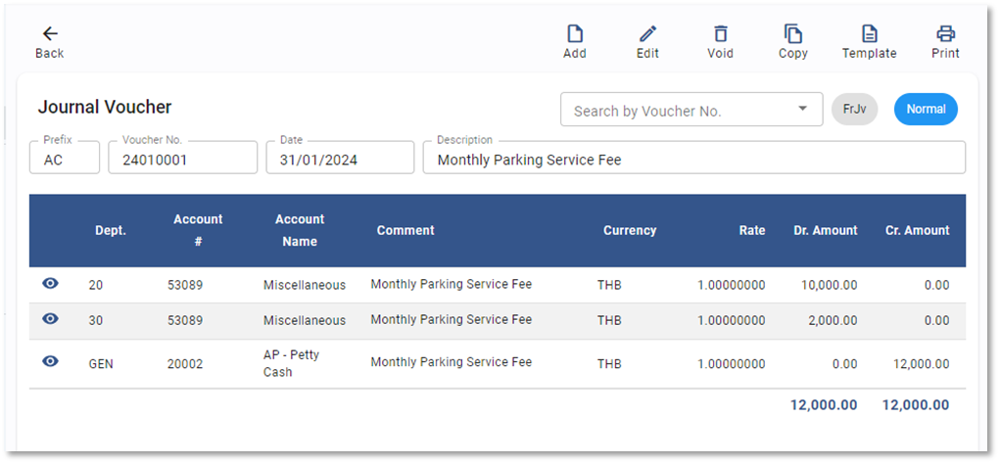

# Recurring Voucher

Function นี้ใช้เพื่อสร้างแม่แบบเอกสารที่มีการบันทึกอยู่เป็นประจำ และมีรอบการบันทึกบัญชีด้วยจำนวนเงินที่เท่ากันอย่างต่อเนื่อง เพื่อช่วยลดปริมาณการบันทึกข้อมูลใน JV และลดความผิดพลาดในการเลือกรหัสบัญชีผิด

## การสร้าง Recurring Voucher

1.1. Click เข้าสู่ General Ledger Module

1.2. Click เลือก Recurring Voucher

1.3. กดปุ่ม 

1.4. ระบบจะแสดงหน้า Recurring Voucher ให้กำหนดค่าดังต่อไปนี้

**หมายเหตุ** เครื่องหมาย \*
(สัญลักษณ์ \* ช่องที่จำเป็นต้องระบุ)

- \* Prefix กำหนดประเภทสมุดบัญชีที่ต้องการสร้าง Template
- Type กำหนดประเภท ระบบ Default เป็น “Recurring”
- Description กำหนดคำอธิบายที่ต้องการให้แสดงในหน้า JV
- From กำหนด Period เริ่มต้นบันทึก JV
- To กำหนด Period สิ้นสุดการบันทึก JV
- Recurring Every Period กำหนดรอบของเดือน (Period) ให้ระบบสร้าง JV โดยอัตโนมัติ เช่น
  - 1 คือ สร้าง 1 JV ในทุก ๆ 1 เดือน
  - 2 คือ สร้าง 1 JV ในทุก ๆ 2 เดือน
  - 3 คือ สร้าง 1 JV ในทุก ๆ 3 เดือน (ไตรมาส)

---

1.5. กดปุ่ม + เพื่อเพิ่มรายการที่จะใช้บันทึกบัญชี

1.6. ระบบจะแสดงหน้าต่าง ดังภาพด้านล่าง ให้ระบุข้อมูลดังต่อไปนี้

**หมายเหตุ** เครื่องหมาย \*
(สัญลักษณ์ \* ช่องที่จำเป็นต้องระบุ)

- \* Department กำหนด Department Code
- \* Account # กำหนด Account code
- Comment คำอธิบายรายการ
- \* Currency กำหนด Currency Code
- \* Rate กำหนด Currency Rate
- \* Amount Dr / Amount Cr ใส่ยอดที่ต้องการบันทึก
- Dimension ใส่ข้อมูล Dimension (ถ้ามี)

---

1.7. ระบุข้อมูลเรียบร้อยแล้ว กด **OK**

1.8. เมื่อเพิ่มรายการจนครบตามที่ต้องการแล้วให้กดปุ่ม **SAVE** เพื่อบันทึก Recurring

1.9. กด **OK** เพื่อเสร็จสิ้นขั้นตอน

    

1.10. เมนูคำสั่งอื่นที่เกี่ยวข้อง

 สร้างเอกสารแม่แบบ

 แก้ไขเอกสารแม่แบบ

 การยกเลิกเอกสารแม่แบบ

 พิมพ์เอกสาร

## การใช้งาน JV Template ประเภท Recurring

2.1. Click เข้าสู่ General Ledger Module

2.2. กดปุ่ม Procedure

2.3. กำหนด Period  ที่ต้องการในหัวข้อ Apply Recurring Template

2.4. Click **APPLY** เพื่อให้ระบบ Generate JV จาก Recurring Voucher ที่ได้กำหนดไว้

2.5. เมื่อระบบทำการ Apply JV เรียบร้อยแล้วจะขึ้นหน้าต่าง แสดงจำนวนสมุดบัญชีที่ถูกสร้างขึ้นในรอบบัญชีนั้น

2.6. หลังจากบันทึกข้อมูล ระบบจะแสดงหน้าต่างผลการบันทึกข้อมูล

    

## การตรวจสอบ JV ที่ถูกสร้างจากการ Apply Recurring Voucher

3.1. Click เข้าสู่ General Ledger Module

3.2. Click Journal Voucher

3.3. Journal Voucher ที่แสดง Source “FrJv”

3.4. Click สัญลักษณ์  ที่ JV ที่ต้องการดูรายละเอียด

3.5. ตัวอย่างรายละเอียดของ JV ที่สร้างจากการ Apply Recurring Voucher โดยอัตโนมัติ

การใช้งานปุ่มอื่น ๆ บนหน้าจอ

4.1 กดปุ่ม  เพื่อค้นหา Recurring Voucher

4.2 กดปุ่ม  เพื่อ Export ข้อมูลออกจากระบบเป็น .csv

4.3 กดปุ่ม  เพื่อพิมพ์ข้อมูล
