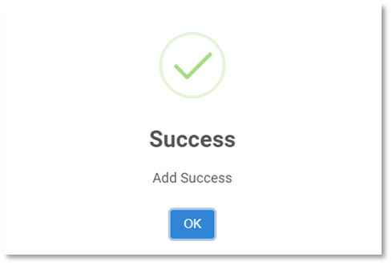

# Template Voucher

Function นี้ใช้เพื่อสร้างแม่แบบเอกสารที่มีการบันทึกอยู่เป็นประจำ เพื่อช่วยลดปริมาณการบันทึกข้อมูลใน JV และลดความผิดพลาดในการเลือกรหัสบัญชีผิด
การสร้าง Template สามารถสร้างได้ 2 วิธี

## การสร้าง Template บนหน้าจอ Template Voucher

มีขั้นตอนการบันทึกดังนี้

1.1. Click เข้าสู่ General Ledger Module

1.2. Click เลือก Template Voucher

1.3. กดปุ่ม 

1.4. ใส่ข้อมูลประเภทสมุดบัญชี (Prefix) และระบุรายละเอียดชื่อ Template

- Prefix กำหนด Prefix ที่ต้องการสร้าง Template
- Type ระบบจะกำหนดค่า “Template” ให้อัตโนมัติ
- Description กำหนดคำอธิบายที่ต้องการให้แสดงใน JV Description

  1.5. Click เครื่องหมาย + เพื่อเพิ่มรายการที่จะใช้บันทึกบัญชี

1.6. ระบบจะแสดงหน้าต่าง ดังภาพด้านล่าง ให้ระบุข้อมูลดังต่อไปนี้

**หมายเหตุ** เครื่องหมาย \*
(สัญลักษณ์ \* ช่องที่จำเป็นต้องระบุ)

- \* Department กำหนด Department Code
- \* Account # กำหนด Account code
- Comment คำอธิบายรายการ
- \* Currency กำหนด Currency Code
- \* Rate กำหนด Currency Rate
- Amount Dr / Amount Cr ใส่ยอดที่ต้องการบันทึก
- Dimension ใส่ข้อมูล Dimension (ถ้ามี)

---

1.7. หลังจากระบุข้อมูลเรียบร้อยแล้วให้ กด **OK**

1.8. เมื่อเพิ่มรายการจนครบตามที่ต้องการแล้วให้กดปุ่ม **SAVE** เพื่อบันทึก Template

1.9. กด **OK** เพื่อเสร็จสิ้นการบันทึกข้อมูล

    

1.10. การใช้งานปุ่มอื่น ๆ หน้าจอ

 สร้างเอกสารแม่แบบ

 แก้ไขเอกสารแม่แบบ

 การยกเลิกเอกสารแม่แบบ

 พิมพ์เอกสาร

## การสร้าง Template จากการ Copy บนหน้าจอ Journal Voucher

**การคัดลอก JV โดยใช้คำสั่ง Copy to Template** ใช้ในกรณีที่ต้องการสร้างเอกสารสมุดบัญชีแม่แบบ (Template) จากสมุดบัญชีที่ได้บันทึกไว้ก่อนแล้ว

2.1 Click เข้าสู่ General Ledger Module

2.2 เลือกเมนู Journal Voucher

2.3 Click สัญลักษณ์  ใน JV ที่ต้องการจะทำการคัดลอก

2.4 ระบบจะเปิด JV ที่เลือกมา
2.5 Click 

2.6 เลือก Copy to Template

    

2.7 Click **OK** เพื่อยืนยันการคัดลอก ระบบจะสร้างเอกสาร JV ขึ้นเป็นแม่แบบ

    

2.8 ระบบสร้างแม่แบบขึ้นอัตโนมัติเพื่อสามารถนำไปใช้เป็นแม่แบบในการบันทึกบัญชี สามารถดูเอกสารที่ function ชื่อ Template Voucher

การใช้งานปุ่มอื่น ๆ บนหน้าจอ

3.1 กดปุ่ม  เพื่อค้นหา Template Voucher

3.2 กดปุ่ม  เพื่อ Export ข้อมูลออกจากระบบเป็น .csv

3.3 กดปุ่ม  เพื่อพิมพ์ข้อมูล
