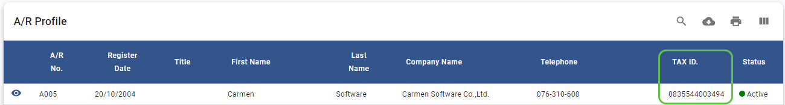
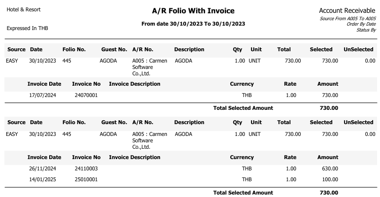
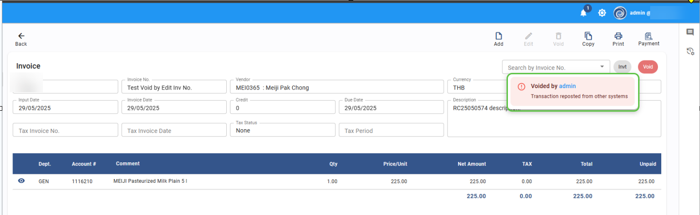
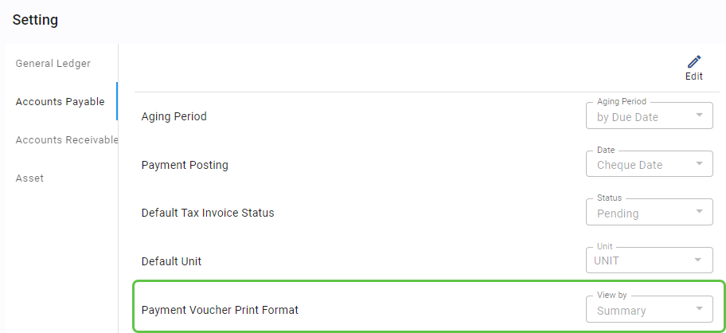
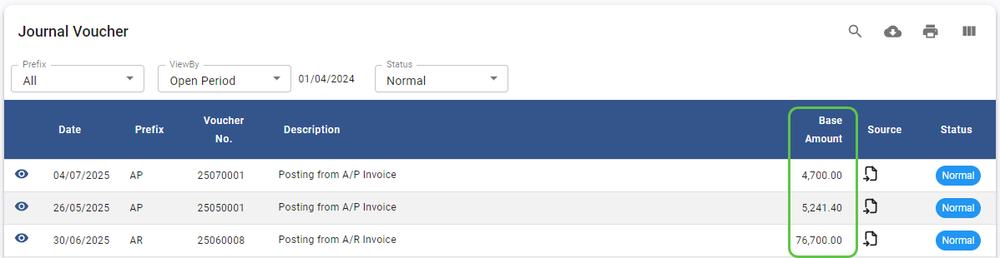
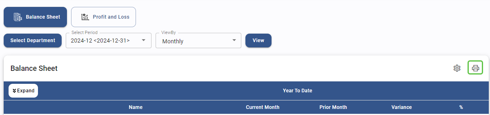

# Released Jul2025

## Account Receivable

- **Account Receivable - Receipt - Fix Bugs Invoice number not running
  properly**

  - **Note :** fix bugs for invoice number not running properly when
    unmark "Auto"

  - **From :** Account Receivable \> Invoice

- **Account Receivable - AR Profile - Show Tax ID in AR profile list
  screen**

  - **Note :** Add field "Tax ID" to AR Profile list screen

  - **From :** Account Receivable \> AR Profile

- **Account Receivable - Report - New Report for Folio / Invoice**

  - **Note :** New Report showing Folio and the associated Invoice
    Number.

  - **From :** Account Receivable \> Report

## Account Payable

- **Account Payable - Invoice - Add void comment if void by posting from
  Receiving**

  - **Note :** When invoice voided by system, System will shows void
    reason

  - **From :** Account Payable \> Invoice

- **Account Payable - Invoice - Add log in Activity when posting from
  Receiving**

  - **Note :** Record an activity log entry upon reposting data from
    receiving

  - **From :** Account Payable \> Invoice

- **Account Payable - Payment - Fix Bug to Not allow posting to GL if
  payment not approved yet**

  - **Note :** System will not post transactions to GL if payment not
    approved

  - **From :** Account Payable \> Payment

- **Account Payable - Payment - Add option to print payment voucher as
  summary or detail**

  - **Note :** customer can set to print Payment voucher by summary or
    detail

  - **From :** Account Payable \> Payment

## Asset

- **Asset - Report - Fix bug for Name List Report**

  - **Note :** Fix bug: System displays all assets even when filtered by
    \'Active\' status.

  - **From :** Asset \> Report \> Name List

## General Ledger

- **General Ledger - Journal Voucher - Show JV total Base amount in JV
  List screen**

  - **Note :** Add field "Base Amount" to Journal voucher List Screen

  - **From :** General Ledger \> Journal Voucher

- **General Ledger - Report - Fix bug for Chart of account report**

  - **Note :** Fix bug: System displays all Account code even when
    filtered by \'Active\' status.

  - **From :** General Ledger \> Report \> Chart of Account

- **General Ledger - Financial Report - Add print function**

  - **Note :** Add function to print Financial report

  - **From :** General Ledger \> Financial Report

