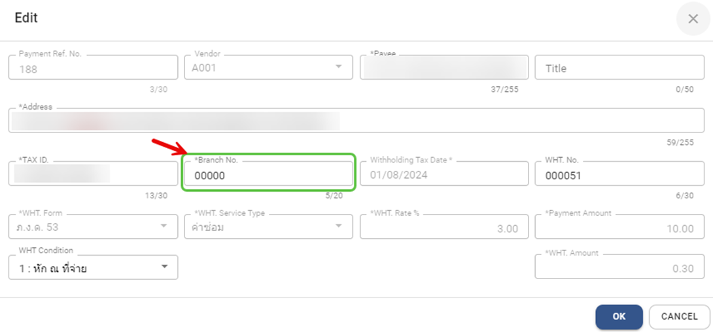
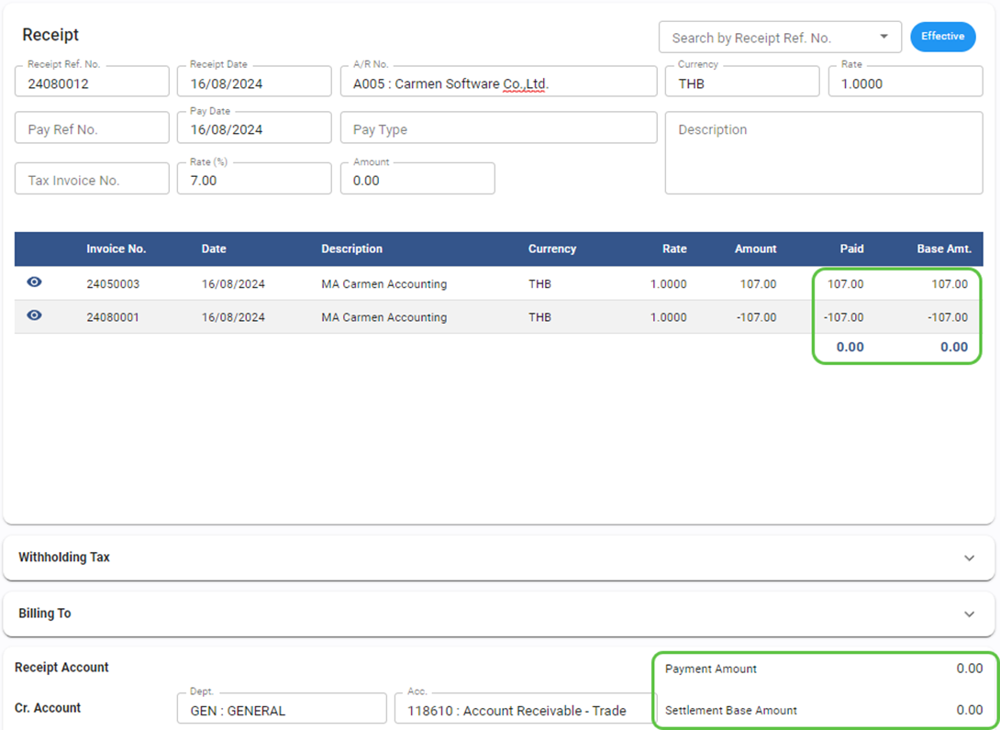
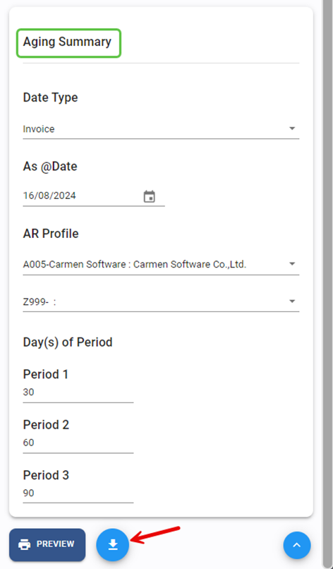
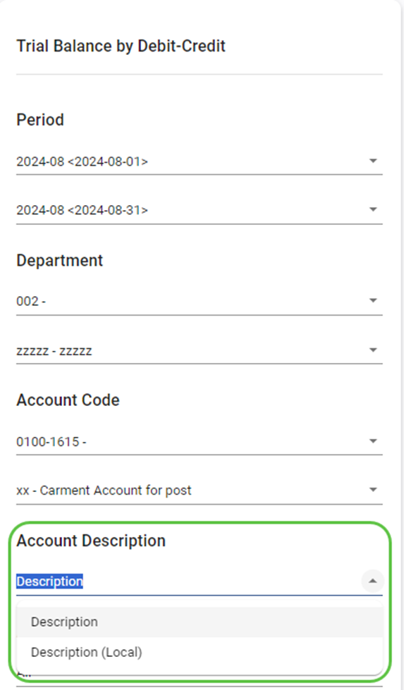
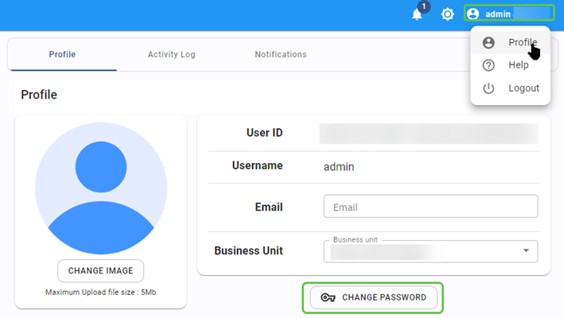

# July 2024 Relaese Infomation

## Accounts Payable Module

### AP – Procedure – Input Tax Reconciliation

- Note : Not allow to save Tax invoice as blank if status is Confirm
- From : Accounts Payable Module 🡪 Procedure 🡪 Input Tax Reconciliation

### AP – Procedure – WHT Reconciliation

- Note : Add “Branch No” field to screen
- From : Accounts Payable Module 🡪 Procedure 🡪 WHT Reconciliation

## Accounts Receivable Module

### AR – Receipt – Allow to save with amount zero

- Note : Allow to apply CN with Invoice and save with amount zero
- From : Accounts Receivable Module 🡪 Procedure 🡪 Input Tax Reconciliation

### AR – Procedure – Aging Summary Report

- Note : Add option to export as csv
- From : Accounts Receivable Module 🡪 Report 🡪 Aging Summary

    

## Asset Module

### Asset – Asset Register – Change field name

- Note : change field name for account code mapping from “Cost” to “Asset”
- From : Asset Module 🡪 Asset Register

### Asset – Asset Register – Allow to edit account code mapping

- Note : allow to edit account code mapping after close period
- From : Asset Module 🡪 Asset Register

## General Ledger Module

### GL – Procedure – Posting from AR – Invoice from Folio will not post to GL

- Note : new option to skip posting invoice from folio to avoid duplicate with PMS Daily posting
- From : General Ledger Module 🡪 Report 🡪 Trial Balance by Debit/Credit

### GL – Report – Trial Balance by Debit/Credit – Add option to show local description

- Note : new option shows local (Thai) description in report
- From : General Ledger Module 🡪 Report 🡪 Trial Balance by Debit/Credit

    

## User Profile Setup

### User Profile – Solve error reset password

- Note : Solve error when reset password
- From : User 🡪 Profile 🡪 change password

    

