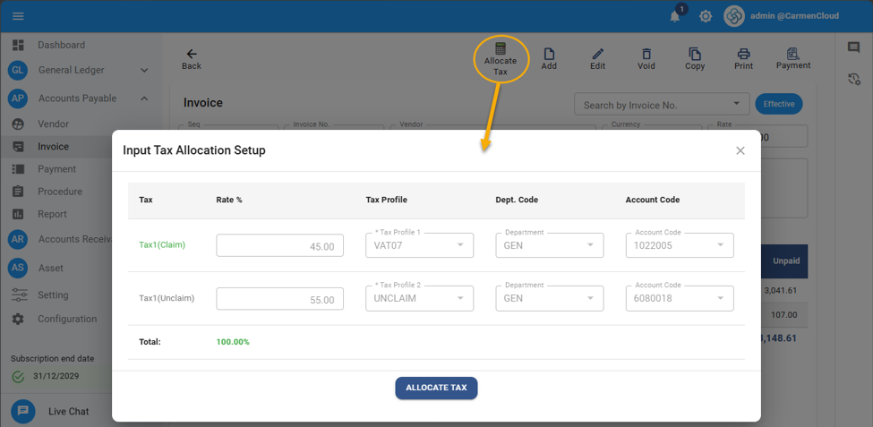
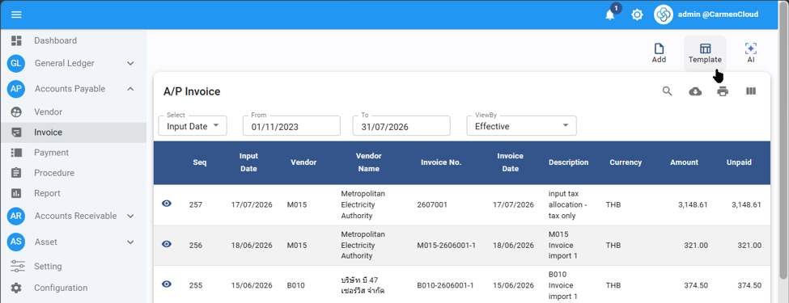
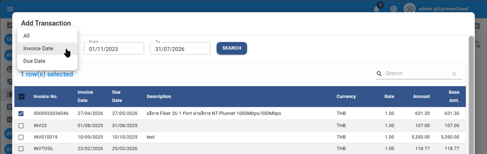
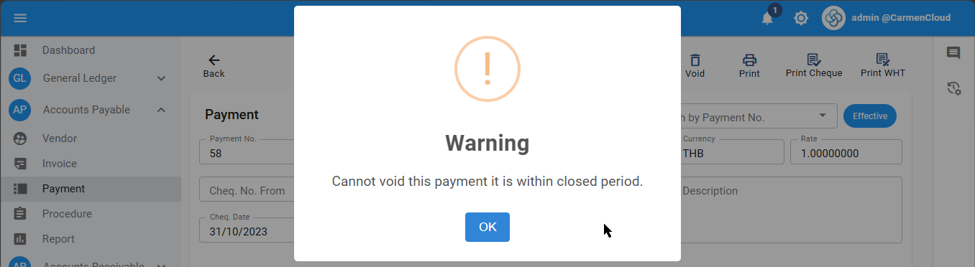
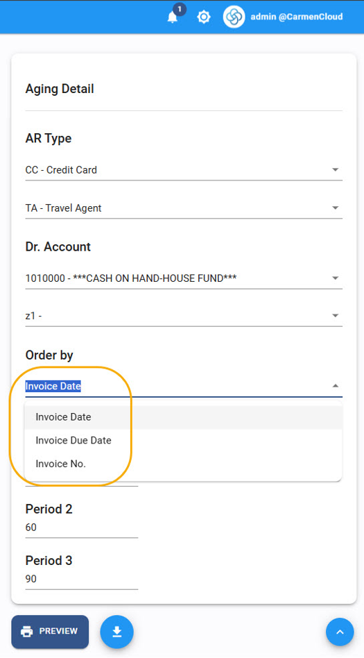
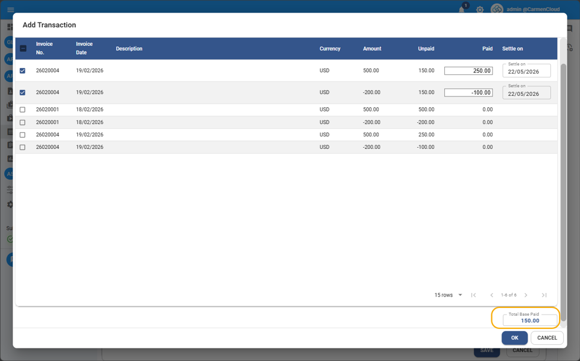
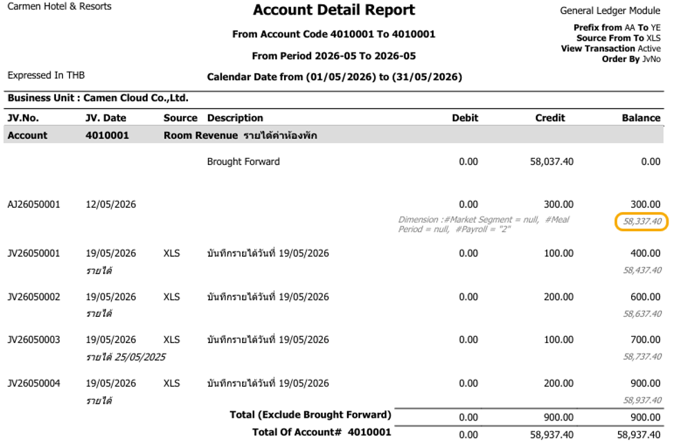
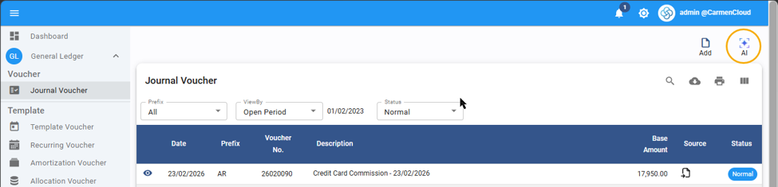
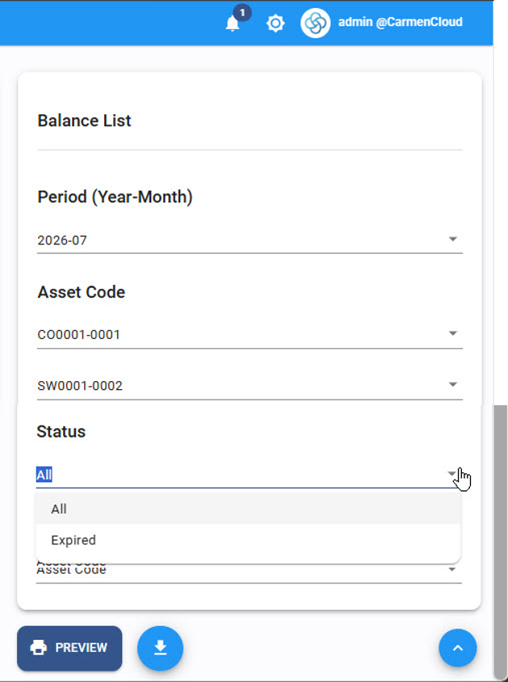

# Carmen Cloud: July 2026 Release Highlights

We are excited to share the July 2026 updates for Carmen Cloud. This release focuses on delivering seamless user experiences, elevating system precision, and empowering your daily financial operations with robust integrity guards.

## Account Payable

### Title: Precise Due Date Calculation on Input Date Change
- **Note**: We enhanced system reliability by ensuring the due date is accurately recalculated whenever the input date is modified.
- **Path**: Account Payable > AP Invoice

### Title: New "Input Tax Allocation" for Real Estate
- **Note**: We have introduced the "Input Tax Allocation" feature to seamlessly support and empower real estate business operations.
- **Path**: Account Payable > AP Invoice

    

### Title: Seamless AP Invoice Import via Excel Template
- **Note**: Accelerate your workflow with the new import feature, allowing you to seamlessly create AP Invoice documents directly from an Excel template.
- **Path**: Account Payable > AP Invoice

    

### Title: Flexible Invoice Filtering for Payments
- **Note**: Empower your payment process with a new option to filter and select invoices by either Invoice Date or Due Date, streamlining your workflow.
- **Path**: Account Payable > Payment

    

### Title: Secure Payment Voiding Control
- **Note**: We introduced an advanced integrity guard to prevent the voiding of payments within closed accounting periods, securing your financial data.
- **Path**: Account Payable > Payment

    

### Title: Accurate Input Tax Reconciliation for Negative Amounts
- **Note**: We polished the Input Tax Reconciliation process to accurately handle reverse Journal Vouchers (TX) with negative tax amounts, ensuring precise debit adjustments.
- **Path**: Account Payable > Input Tax Reconciliation

## Account Receivable

### Title: Enhanced Aging Detail Report Sorting
- **Note**: You can now seamlessly organize your Aging Detail report by sorting data using either the Invoice Date or Invoice Number, empowering clearer insights.
- **Path**: Account Receivable > Report

    

### Title: Real-Time Total Amount Display on Receipts
- **Note**: The receipt document now displays the total amount of selected invoices in real-time, streamlining your payment collection process and making invoice selection effortless.
- **Path**: Account Receivable > Receipt

    

## General Ledger

### Title: Enhanced Posting via BlueLedgers Interface
- **Note**: We have elevated the interface capabilities, allowing you to seamlessly post data from the Inventory module and accurately record accounts for the source location.
- **Path**: General Ledger > Interface

### Title: Persistent Headers for Account Detail by Department
- **Note**: The Account Detail by Department report now seamlessly repeats the Account Code and Department Code headers on every new page for effortless reading.
- **Path**: General Ledger > Report

### Title: Export Account Detail Dimensions to Excel
- **Note**: Empower your data analysis by seamlessly exporting dimension data from the Account Detail report directly into Microsoft Excel.
- **Path**: General Ledger > Report

### Title: Accumulated Amount Display on Account Detail
- **Note**: The Account Detail report now provides a comprehensive view by displaying the accumulated amount, including brought-forward balances, ensuring a clearer financial overview.
- **Path**: General Ledger > Report

    

### Title: Introducing Carmen AI Interface
- **Note**: Experience the future of accounting with our new Carmen AI. It empowers your workflow by automatically reading Credit Card Commission documents to generate JVs and Input Tax Reconciliations, auto-generating AP Invoices for direct purchases, and providing smart AI suggestions for precise account recording.
- **Path**: General Ledger > AI

    

## Asset Management

### Title: Expired Asset Filter for Balance List
- **Note**: Seamlessly manage your asset lifecycle with a new parameter in the Balance List report, allowing you to filter and view only expired assets.
- **Path**: Asset > Report

    

