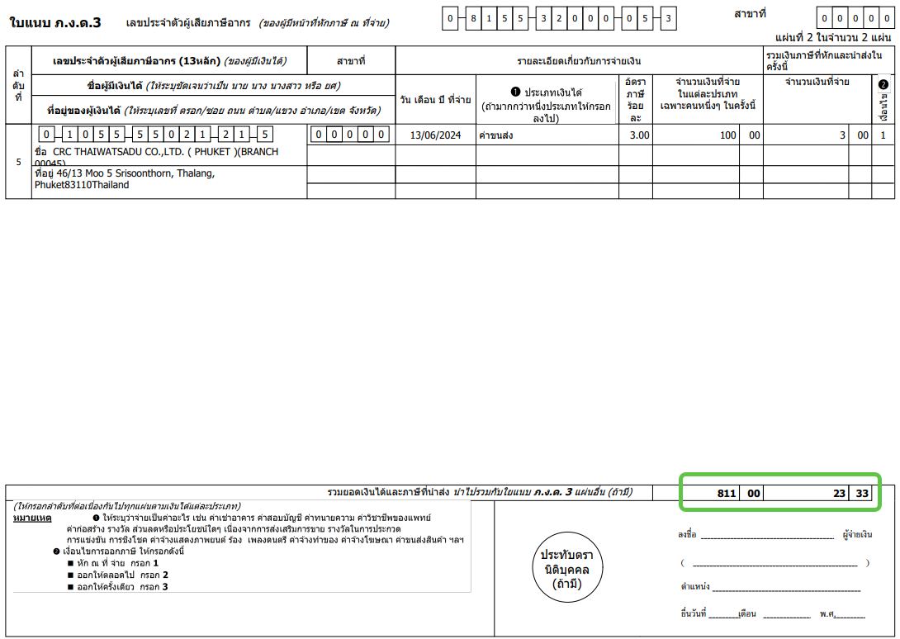
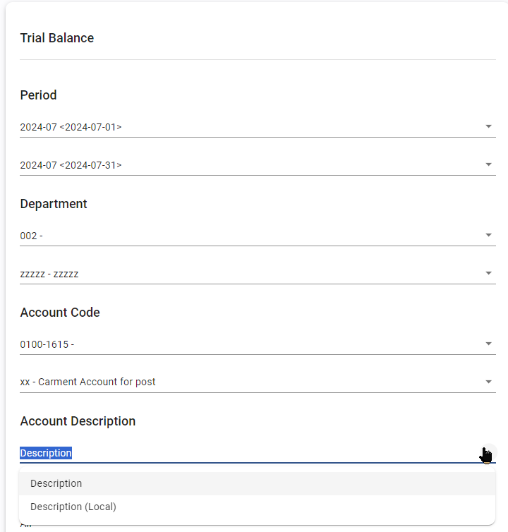
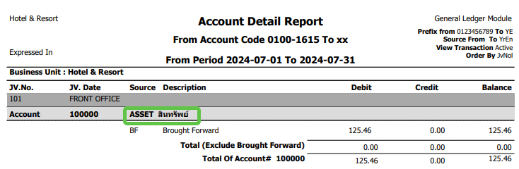
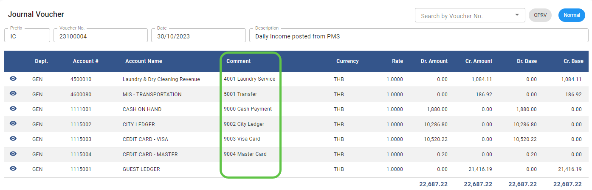

# June 2024 Relaese Infomation

### AP – Procedure – WHT Reconciliation – WHT Report

- Note : shows total for each page as cumulative total 
- From : Accounts Payable Module 🡪 Procedure 🡪 WHT Reconciliation 🡪 WHT Report

### GL –  Report - Trial Balance – shows Local (Thai) description

- Note : new option shows local (Thai) description in report
- From : General Ledger Module 🡪 Report 🡪 Trial Balance

### GL –  Report – Account detail – shows Local (Thai) description

- Note : new option shows local (Thai) description in report
- From : General Ledger Module 🡪 Report 🡪 Account detail 
         General Ledger Module 🡪 Report 🡪 Account detail with department

### GL – Journal Voucher – shows comment 

- Note : show comment of detail on the screen
- From : General Ledger Module  Journal Voucher

