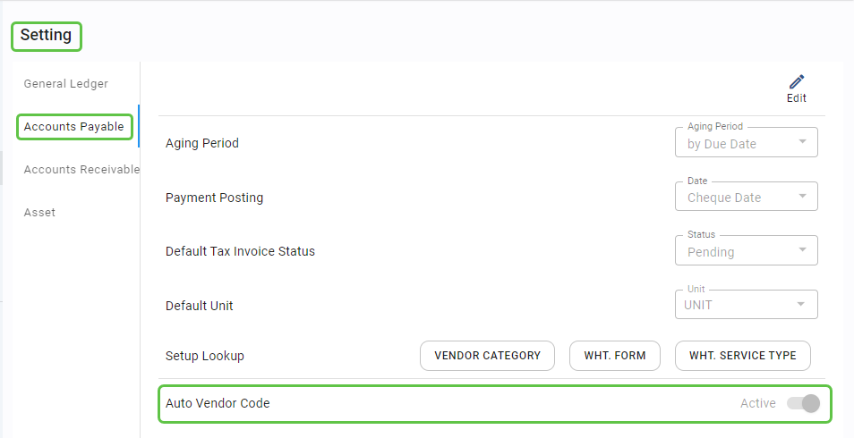
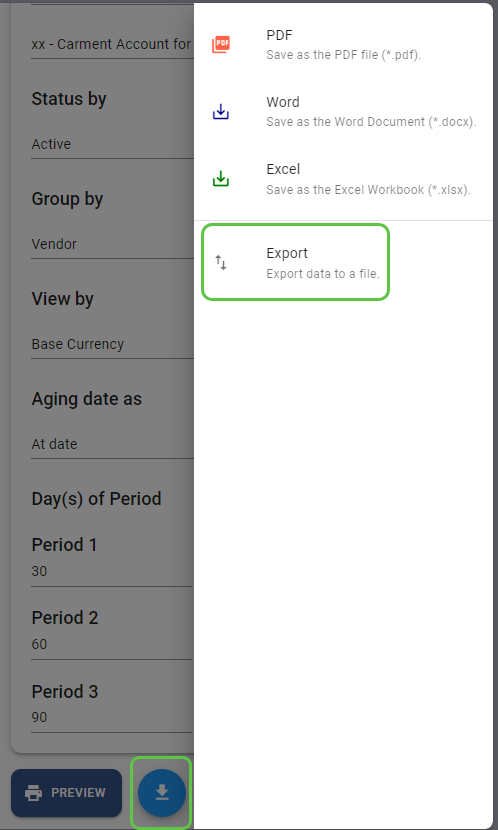
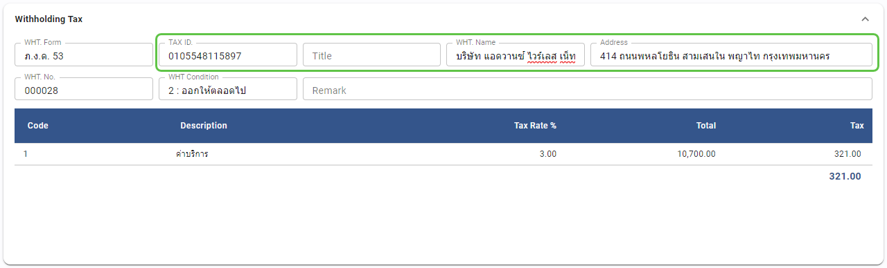
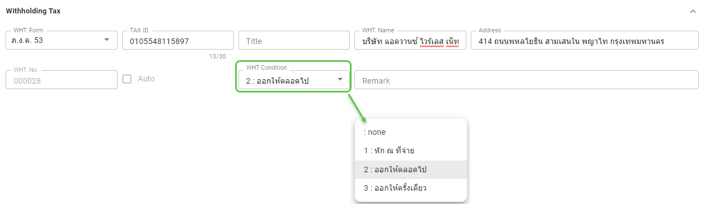
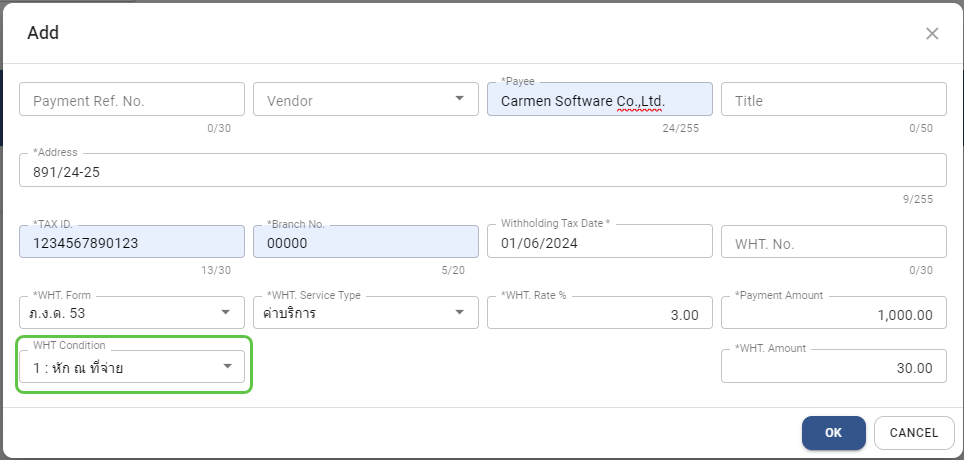
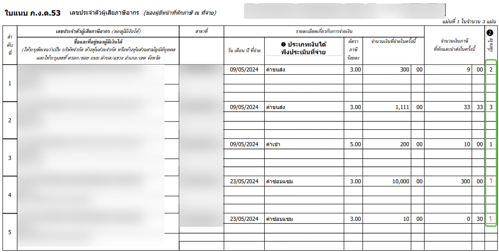
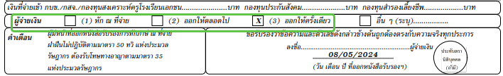
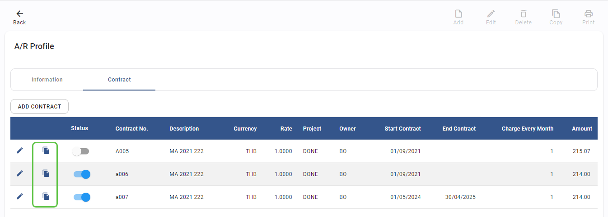
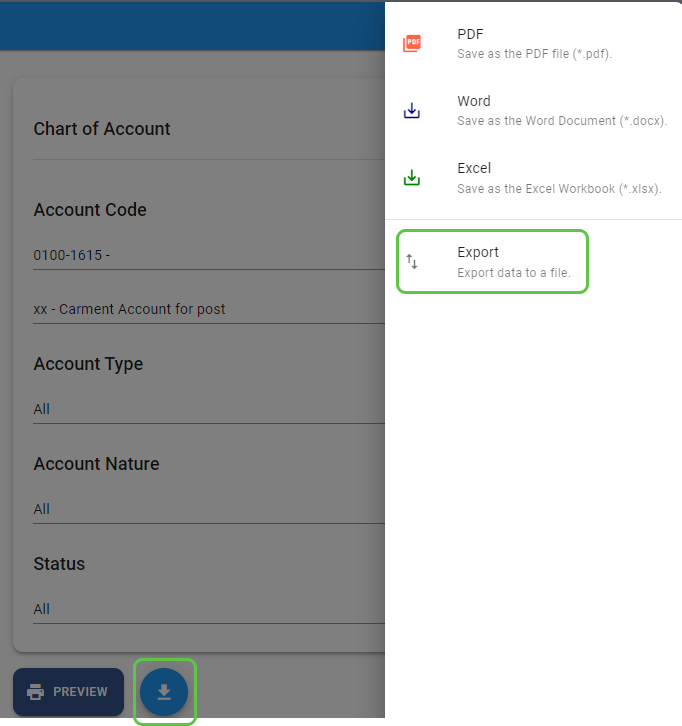

# May 2024 Relaese Infomation

### Setting - AP - New Function for Auto running vendor code

- Note : This is new functions to allow running the vendor code automatically by start from 00001
- From : setting 🡪 Accounts Payable 🡪 Auto Vendor Code

### AP - Aging summary report - Add option to export data

- Note : new option to export data as table
- From : Accounts Payable Module 🡪 Report 🡪 Aging summary 🡪 download button 🡪 Export

### AP - Payment - Allow to edit WHT information

- Note : Allow to edit WHT information in Payment after get default value from vendor profile
- From : Accounts Payable 🡪 Payment 🡪 Withholding Tax information

### AP - Payment - WHT condition change to drop down list

- Note : WHT condition change to select from drop down list
- From : Accounts Payable 🡪 Payment 🡪 Withholding Tax information

### AP - Payment - check WHT information cannot blank if WHT amount is not zero

- Note : if WHT amount is not zero, system not allow to save if required information is blank such as TAX ID, WHT Name, Address and WHT Condition
- From : Accounts Payable 🡪 Payment 🡪 Withholding Tax information

### AP - Withholding Tax Reconciliation - add Field for Ref. to handle WHT condition

- Note : Add field “WHT. Ref.” for record WHT Condition
- From : Accounts Payable 🡪 Withholding Tax Reconciliation 🡪 Add

### AP - Withholding Tax Reconciliation - Apply WHT condition to WHT 3 and 53 Report

- Note : show WHT condition to WHT 3 and 53 Report
- From : Accounts Payable 🡪 Withholding Tax Reconciliation 🡪 Print Report

### AP - Withholding Tax Reconciliation - Apply WHT condition to WHT certificate

- Note : show WHT condition to WHT certificate
- From : Accounts Payable 🡪 Withholding Tax Reconciliation 🡪 Print Form

### AR - Contract : New function to copy from existing contract

- Note : Add option to copy contract from existing contract
- From : Accounts Receivable 🡪 A/R Profile 🡪 Contract

### GL - Chart of account report - Add option to export data

- Note : new option to export data as table
- From : General Ledger Module 🡪 Report 🡪 Chart of Accounts 🡪 download button 🡪 Export

