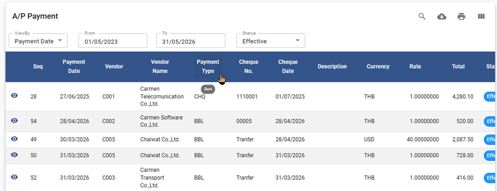
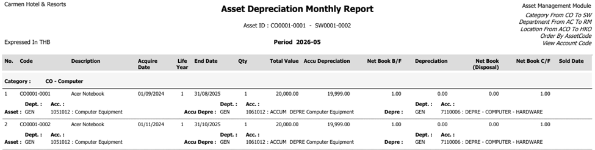
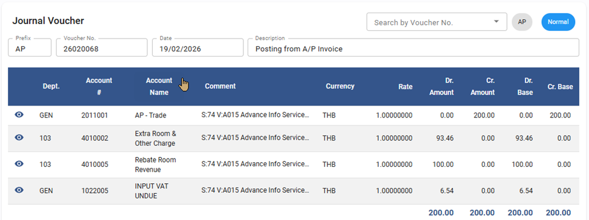
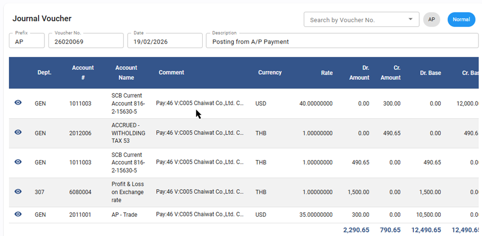

# Carmen Cloud: May 2026 Release Highlights

We are dedicated to refining Carmen Cloud to provide a seamless and high-precision financial management experience. This month’s update focuses on expanding reporting depth, strengthening multi-currency integrity, and polishing system navigation to empower your daily operations.

## AddIn

### Title: Reliable Account Detail Reporting (v3.972)
- **Note**: Ensure complete data integrity when pulling account details into your workbook. To benefit from these system guards, please update the Add-In to version 3.972 and download the latest workbook for optimal performance.
- **Path**: AddIn > Report

## Account Payable

### Title: Enhanced Due Date Accuracy for Copied Invoices
- **Note**: Streamline your workflow with intelligent due date recalculations when duplicating invoices, ensuring your financial schedules remain precise without the need for manual adjustments.
- **Path**: Account Payable > AP Invoice

### Title: Refined WHT Reporting for Philippines Compliance
- **Note**: We have enhanced the security of the Receiving Repost process by implementing a status validation check. The system now prevents re-posting if an Invoice is already confirmed or filed. This update helps maintain the accuracy of your tax records and prevents unintended data overwrites.
- **Path**: Account Payable > Payment

### Title: Flexible Data Navigation in Payment Listing
- **Note**: Empower your administrative tasks with the new ability to sort payment records (Payment Type, Rate and Total), allowing for faster lookups and more organized data management.
- **Path**: Account Payable > Payment

    

## Asset

### Title: Refined WHT Reporting for Philippines Compliance
- **Note**: Gain deeper visibility into your asset management with the addition of department and account code mapping directly within the Monthly Depreciation report.
- **Path**: Asset > Report

    

## General Ledger

### Title: Professional Financial Report Presentation
- **Note**: Ensure your printed financial statements are always boardroom-ready with corrected period displays for all built-in financial reports.
- **Path**: General Ledger > Financial Report

### Advanced Multi-Currency Intelligence for Postings
- **Note**: Strengthen your global accounting integrity with enhanced posting logic that now captures transaction currencies and amounts from the AP module with full precision.
- **Path**: General Ledger > Procedure > Posting from AP

    

    

