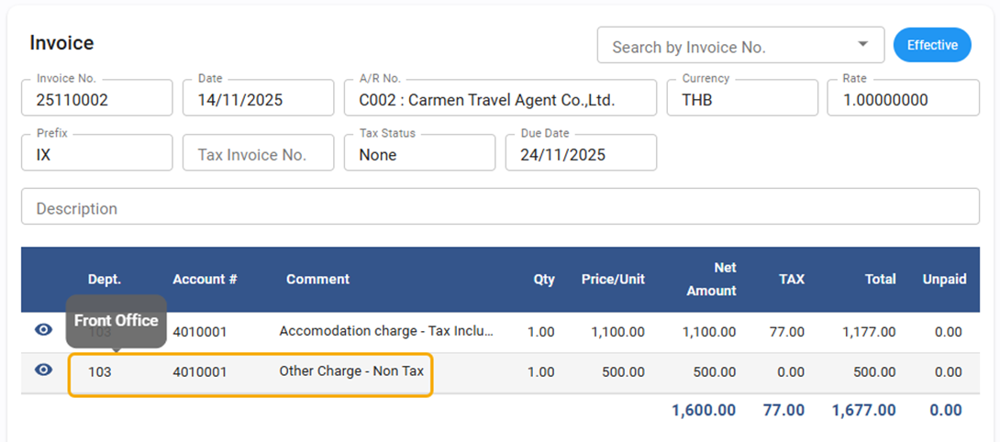
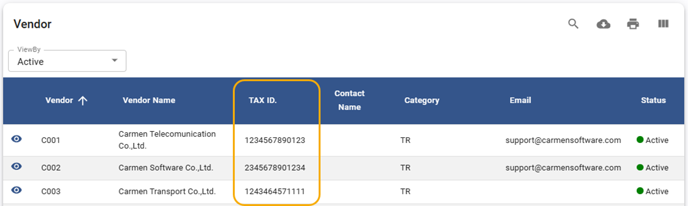
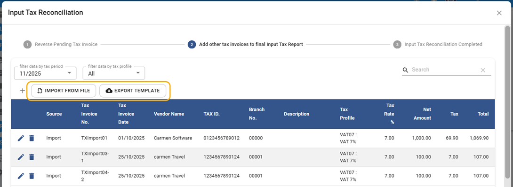
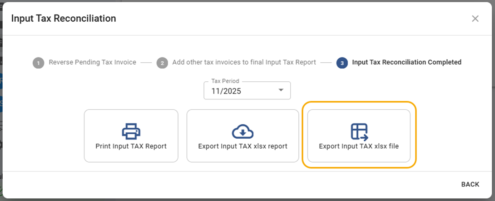
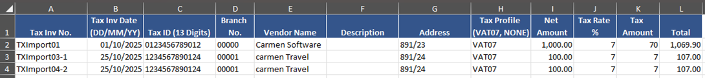
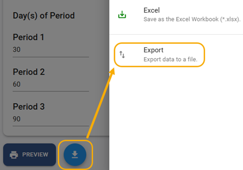
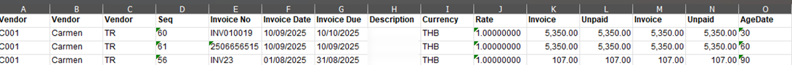
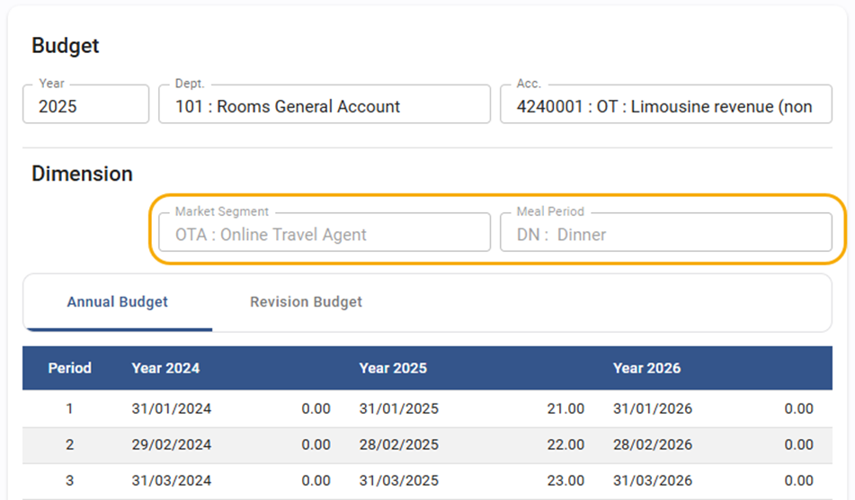
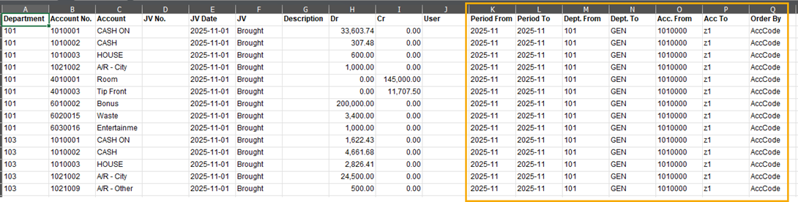

# November 2025 Relaese Infomation

## Account Receivable

### Account Receivable - Invoice - Hover the field to shows more detail

- Note : When hover the mouse over Department code, Account code and Comment, System will shows more information
- From : Account Receivable > Invoice

    

### Account Receivable - Receipt - Allow to edit Deposit Receipt in close period

- Note : Allow to edit and save Deposit Receipt in close period
- From : Account Receivable > Receipt

## Account Payable

### Account Payable - Vendor Profile - Shows Tax ID in List screen

- Note : Shows Tax ID in Vendor List screen
- From : Account Payable > Vendor

    

### Account Payable - Input Tax Reconciliation - New feature for import Tax invoice by excel template

- Note : New Feature to fill in Input Tax information in Excel template and import to system
- From : Account Payable > Procedure > Input Tax Reconciliation

    

### Account Payable - Input Tax Reconciliation - New feature for Export Tax invoice as Excel compatible

- Note : New feature to export tax invoice which is compatible with excel column
- From : Account Payable > Procedure > Input Tax Reconciliation

    

    

### Account Payable - Cheque Reconciliation - Increase verification process before save

- Note : Increase verification process before save to avoid incorrect condition
- From : Account Payable > Procedure > Cheque Reconciliation

    

    

## General Ledger

### General Ledger - Budget - Update view for Budget with dimension

- Note : Update view in Budget screen to shows multiple dimensions analysis
- From : General Ledger > Budget

    

### General Ledger - Report - New feature to export Account detail report with parameter

- Note : Exported file will shows data with report parameters
- From : General Ledger > Report > Account Detail and Account Detail with department

    

## Report

### All Report – Report will default as current date or current month

- Note : change default value for date parameter for all report
- From : All Report
