# Carmen Work Book Function

Carmen Work Book คือ Excel file ตาม Standard ของ Carmen ที่ใช้สำหรับเรียกดูรายงานและ Upload ข้อมูลเข้าระบบผ่าน Excel

**Login** เข้าระบบเพื่อเริ่มใช้งาน

- เปิดไฟล์ Carmen Workbook ที่มี (สามารถขอ Standard file ได้จาก support)
- Click Login เพื่อเข้าสู่ระบบ

    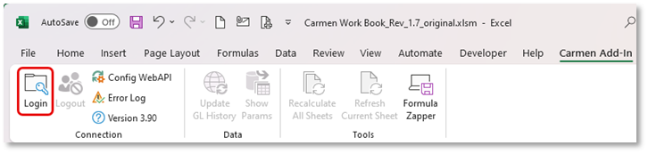

- ระบบจะแสดงหน้าต่างเข้าระบบ User Name และ Pass Word เพื่อยืนยันตัวตนผู้ใช้งาน

    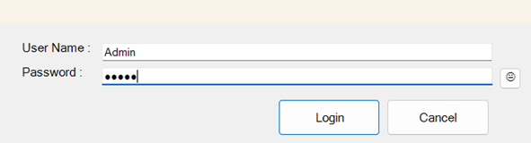

ข้อมูลเพิ่มเติมในไฟล์ Carmen Workbook ประกอบไปด้วย Sheet ต่างๆ ดังนี้

## Intro Sheet

ใช้สำหรับกำหนด Business Unit (BU) ที่ต้องการเชื่อมต่อกับระบบ

    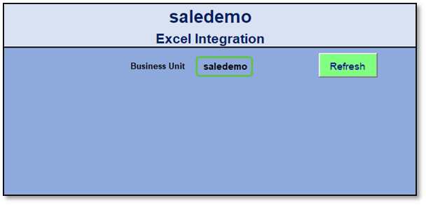

## JV multiple Import

ใช้สำหรับการบันทึกข้อมูล JV ผ่าน Excel Workbook และ Import JVเข้า Module GL

2.1. กรอกข้อมูล JV ให้ครบถ้วน โดยมีข้อมูลดังนี้ (เครื่องหมาย \* คือข้อมูลที่จะเว้นว่างไม่ได้)

- \*Date กำหนดวันที่ JV ต้องกรอกให้ถูก format เพื่อป้องกันการบันทึกผิดวันและเดือน (format ของวันที่จะขึ้นอยู่กับการตั้งค่าของเครื่อง Client เช่น dd/mm/yyyy หรือ mm/dd/yyyy)
- \*Prefix กำหนด Prefix เพื่อกำหนดหมวดหมู่ของ JV (ข้อมูลจะต้องตรงกับระบบ)
- JV No. เว้นว่างเอาไว้ (เมื่อ import เสร็จแล้วระบบจะแสดงเลข JV ให้เห็น โดยอัตโนมัติ)
- Description กำหนดคำอธิบายที่จะแสดงบน header ของ JV (แนะนำให้กรอกเหมือนกันทุกบรรทัดภายใน JV ใบเดียวกัน)
- \*Currency กำหนดรหัสสกุลเงิน (ข้อมูลจะต้องตรงกับระบบ)
- \*Rate กำหนดอัตราแลกเปลี่ยน
- \*Dept. Code รหัสแผนกที่ใช้บันทึกบัญชี (ข้อมูลจะต้องตรงกับระบบ)
- \*Acc. Code รหัสบัญชีที่ใช้บันทึกบัญชี (ข้อมูลจะต้องตรงกับระบบ)
- Acc. Desc เมื่อกรอก Acc. Code ระบบจะแสดงชื่อบัญชีให้อัตโนมัติ
- Comment Detail กรอกคำอธิบายของ Detail รายการนั้น
- Dr Amount จำนวนเงิน (Base Amount) ในด้าน Debit
- Cr Amount จำนวนเงิน (Base Amount) ในด้าน Credit
- Market Segment รหัส Dimension เพิ่มเติมขึ้นอยู่กับการใช้งานของแต่ละลูกค้า
- Meal Period รหัส Dimension เพิ่มเติมขึ้นอยู่กับการใช้งานของแต่ละลูกค้า
- Project รหัส Dimension เพิ่มเติมขึ้นอยู่กับการใช้งานของแต่ละลูกค้า

 
2.2. ตรวจสอบ Balance Total ต้องมีค่าที่เท่ากัน (หากมียอด Diff จะไม่สามารถ Import JV ได้)

2.3. กดปุ่ม Import to GL เพื่อ Upload ข้อมูลไปยังระบบ GL ใน Carmen Accounting

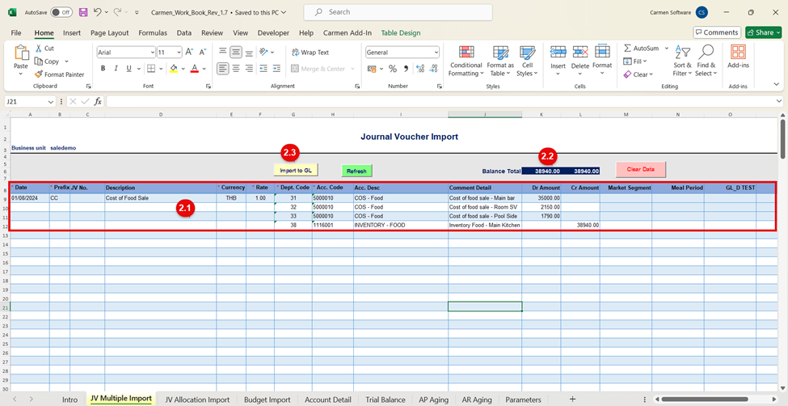

2.4. เมื่อ Click Import to GL เรียบร้อยแล้วระบบจะแสดง Pop up Message แจ้งให้ทราบว่า “Import Success” และจะแสดงเลขที่ JV ในช่อง JV No.

2.5. Remark หมายเหตุการณ์ใช้งาน

- หากต้องการบันทึก JV หลาย ๆ ใบพร้อม ๆ กันให้เว้นว่างเอาไว้ 1 บรรทัดก่อนกรอกข้อมูล JV ใบใหม่

    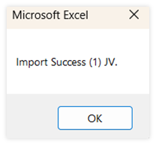

## JV Allocation Import

ใช้สำหรับกระจายค่าใช้จ่ายโดยเฉลี่ยตามสัดส่วนต่อ Unit

3.1. กรอกข้อมูล JV ให้ครบถ้วน โดยมีข้อมูลดังนี้ (เครื่องหมาย \* คือข้อมูลที่จะเว้นว่างไม่ได้)

- \*Date กำหนดวันที่ JV ต้องกรอกให้ถูก format เพื่อป้องกันการบันทึกผิดวันและเดือน (format ของวันที่จะขึ้นอยู่กับการตั้งค่าของเครื่อง Client เช่น dd/mm/yyyy หรือ mm/dd/yyyy)
- \*Prefix กำหนด Prefix เพื่อกำหนดหมวดหมู่ของ JV (ข้อมูลจะต้องตรงกับระบบ)
- Description กำหนดคำอธิบายที่จะแสดงบน header ของ JV (แนะนำให้กรอกเหมือนกันทุกบรรทัดภายใน JV ใบเดียวกัน)
- \*Currency กำหนดรหัสสกุลเงิน (ข้อมูลจะต้องตรงกับระบบ)
- \*Rate กำหนดอัตราแลกเปลี่ยน
- \*Dept. Code รหัสแผนกที่ใช้บันทึกบัญชี (ข้อมูลจะต้องตรงกับระบบ)
- \*Acc. Code รหัสบัญชีที่ใช้บันทึกบัญชี (ข้อมูลจะต้องตรงกับระบบ)
- Acc. Desc เมื่อกรอก Acc. Code ระบบจะแสดงชื่อบัญชีให้อัตโนมัติ
- Comment Detail กรอกคำอธิบายของ Detail รายการนั้น

 
3.2. Allocate

- กรอกจำนวนเงินรวมของค่าใช้จ่ายหรือรายได้ที่ต้องการจะกระจายให้แต่ละแผนก
- กรอกจำนวนเงินในช่อง Credit เพื่อปรับปรุงค่าใช้จ่ายรวมออกก่อนกระจายให้แต่ละแผนก
- กรอกจำนวนเงินในช่อง Debit เพื่อปรับปรุงรายได้รวมออกก่อนกระจายให้แต่ละแผนก
- ต้องเลือกการบันทึกว่าจะเป็น Debit หรือ Credit อย่างใดอย่างหนึ่ง

 
3.3. จำนวน (Unit)

- ไม่ต้องกรอกตัวเลขสำหรับบรรทัดแรก
- กำหนดสัดส่วนที่ต้องการปันส่วน โดยอาจจะกรอกข้อมูลตาม head count หรือเป็น %
- Total ของ จำนวน ไม่จำเป็นต้องเท่ากับ 100

 
3.4. กด Refresh เพื่อให้คำนวณตัวเลขในช่อง Dr Amount หรือ Cr Amount ตามจำนวนที่กรอกเอาไว้

3.5. ตรวจสอบ Balance Total ต้องมีค่าที่เท่ากัน (หากมียอด Diff จะไม่สามารถ Import JV ได้)

3.6. กดปุ่ม Import to GL เพื่ออับโหลดข้อมูลไปยังระบบ GL ใน Carmen Accounting

3.7. ระบบจะแสดงเลขที่ JV เมื่อ import ข้อมูลสำเร็จ

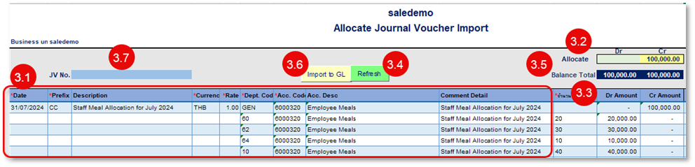

3.8. เมื่อ Click Import to GL เรียบร้อยแล้วระบบจะแสดง Pop up Message แจ้งให้ทราบว่า “Import Success”

3.9. Remark หมายเหตุเพิ่มเติม

- สามารถ import ข้อมูลได้ครั้งละ 1 JV
- กรณีที่ต้องการแก้ไขข้อมูลต้องเข้าไปแก้ไขข้อมูล Jounal Voucher ที่ Import เข้าไปแล้ว ต้องเข้าไปแก้ไขในระบบ หาก Import ใหม่จำเป็นการสร้าง JV ใบใหม่

    

## Budget Import Sheet

ใช้สำหรับใส่ข้อมูล Budget Amount เพื่อ Upload ข้อมูลเข้าสู่ระบบ

4.1. กำหนดปีที่ต้องการ Import Budget

4.2. กำหนด Revision ที่ต้องการ Import Budget (กำหนดเป็น 0 ในกรณี import Budget หลัก) ในระบบจะรองรับได้สูงสุด 4 Revision

4.3. ระบุข้อมูล Revenue & Expenses Budget ทั้ง 12 เดือน โดยให้บันทึกข้อมูลแยกตามแผนก และ Account Code โดยมีข้อมูลดังนี้ (เครื่องหมาย \* คือข้อมูลที่จะเว้นว่างไม่ได้)

- Business Unit รหัส BU จะอ้างอิงมาจาก sheet ชื่อ Intro
- Department รหัสแผนกที่ใช้บันทึกบัญชี (ข้อมูลจะต้องตรงกับระบบ)
- Account Code รหัสบัญชีที่ใช้บันทึกบัญชี (ข้อมูลจะต้องตรงกับระบบ)
- Account Description เมื่อกรอก Acc. Code ระบบจะแสดงชื่อบัญชีให้อัตโนมัติ
- Period 1-12 กรอกจำนวน Budget ของแต่ละ Period ห้ามเว้นว่างเอาไว้ หากไม่มี Budget ให้กรอก 0

\*\*\*Period หมายถึงเดือนตามรอบบัญชีที่กำหนดเอาไว้ในระบบ ยกตัวอย่างเช่น รอบบัญชีกำหนดไว้เป็น พฤษภาคม 2023 - เมษายน 2024 ดังนั้น Period 1 = พฤษภาคม 2023

- Total งบประมาณรวมทั้งปี
- Market Segment รหัส Dimension เพิ่มเติมขึ้นอยู่กับการใช้งานของแต่ละลูกค้า

  4.4. กด Import to Budget เพื่อ upload ข้อมูลเข้าระบบ

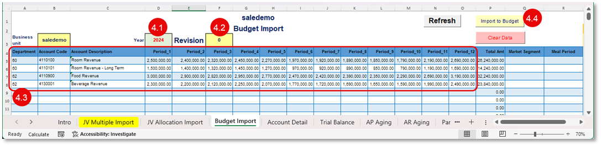

## Account Detail

ใช้สำหรับเรียกรายงาน Account Detail ผ่าน Excel เพื่อใช้ตรวจสอบรายละเอียดการบันทึกบัญชี โดยสามารถเรียกดูข้อมูลแยกแผนกทีละ Acc. Code หรือเรียกดูทุกแผนกรวม Acc. Code ได้

5.1. กำหนด Parameter เพื่อเรียกรายงาน

- From Date กำหนดวันที่เริ่มต้น
- To Date กำหนดวันที่สิ้นสุด
- From Dept. Code กำหนดแผนกเริ่มต้น
- To Dept. Code กำหนดแผนกสิ้นสุด
- From Acc. Code กำหนดรหัสบัญชีเริ่มต้น
- To Acc. Code กำหนดรหัสบัญชีสิ้นสุด
- From Source กำหนดรหัสที่มาของเอกสารเริ่มต้น
- To Source กำหนดรหัสที่มาของเอกสารสิ้นสุด

  5.2. กด OK เพื่อแสดงรายงาน

  5.3. กด Clear เพื่อ clear ข้อมูล

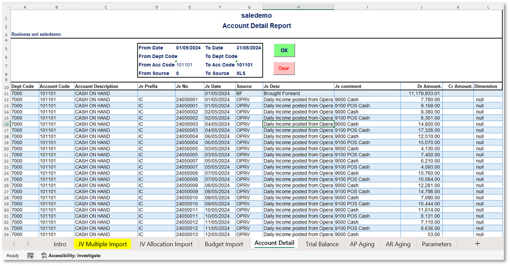

## Trial Balance

ใช้สำหรับเรียกดูรายงาน Balance Report ผ่าน Excel

6.1. กำหนด Parameter เพื่อเรียกรายงาน

- Year กำหนดปีที่ต้องการเรียกรายงาน

- Period กำหนด Period ที่ต้องการเรียกรายงาน

- MTD ระบบจะแสดงกำไรขาดทุนของ Period ที่เรียกรายงาน

- YTD ระบบจะแสดงกำไรขาดทุนสะสมถึง Period ที่เรียกรายงาน

    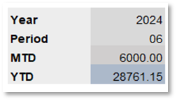

6.2. กด OK เพื่อแสดงรายงาน

6.3. กด Clear เพื่อ clear ข้อมูล

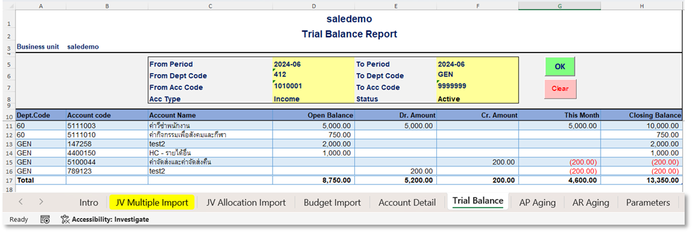

## AP Aging

ใช้สำหรับเรียกดูข้อมูล A/P Aging แบบ Summary ผ่าน Excel

7.1. กำหนด Parameter เพื่อเรียกรายงาน

- As At Date กำหนดวันที่ที่ต้องการดู Aging ระบบจะแสดงข้อมูลตั้งแต่เริ่มต้นจนถึงวันที่เรียกรายงาน
- From Vendor Category กำหนดประเภทเจ้าหนี้เริ่มต้น (เว้นว่างได้)
- To Vendor Category กำหนดประเภทเจ้าหนี้สิ้นสุด (เว้นว่างได้เพื่อแสดงข้อมูลทั้งหมด)
- From Vendor Code กำหนดรหัสเจ้าหนี้เริ่มต้น (เว้นว่างได้)
- To Vendor Code กำหนดรหัสเจ้าหนี้สิ้นสุด (เว้นว่างได้เพื่อแสดงข้อมูลทั้งหมด)
- From Account Code กำหนดรหัสบัญชีเริ่มต้น (เว้นว่างได้)
- To Account Code กำหนดรหัสบัญชีสิ้นสุด (เว้นว่างได้เพื่อแสดงข้อมูลทั้งหมด)

  7.2. กด OK เพื่อแสดงรายงาน

  7.3. กด Clear เพื่อ clear ข้อมูล

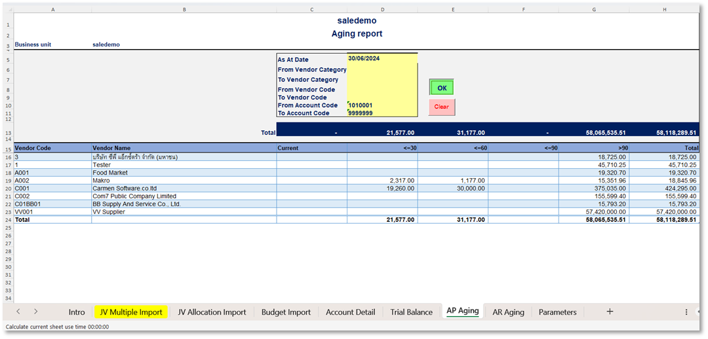

## AR Aging

ใช้สำหรับเรียกดูข้อมูล A/R Aging แบบ Summary ผ่าน Excel

8.1. กำหนด Parameter เพื่อเรียกรายงาน

- As At Date กำหนดวันที่ที่ต้องการดู Aging ระบบจะแสดงข้อมูลตั้งแต่เริ่มต้นจนถึงวันที่เรียกรายงาน
- From AR No. กำหนดรหัสเจ้าหนี้เริ่มต้น (เว้นว่างได้)
- To AR No. กำหนดรหัสเจ้าหนี้สิ้นสุด (เว้นว่างได้เพื่อแสดงข้อมูลทั้งหมด)
- From AR Type กำหนดประเภทเจ้าหนี้เริ่มต้น (เว้นว่างได้)
- To AR Type กำหนดประเภทเจ้าหนี้สิ้นสุด (เว้นว่างได้เพื่อแสดงข้อมูลทั้งหมด)

  8.2. กด OK เพื่อแสดงรายงาน

  8.3. กด Clear เพื่อ clear ข้อมูล

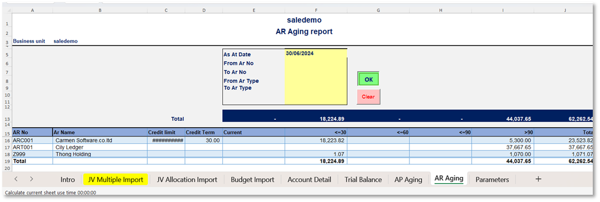

**หมายเหตุ:**

- หากต้องการเก็บเป็น Template เพื่อใช้สำหรับการบันทึกงานต่างประเภทกัน แนะนำให้ทำการ copy หรือ save as file และตั้งชื่อเป็นไฟล์ใหม่ เนื่องจากไม่สามารถ copy sheet ไปใช้ในไฟล์เดียวกันได้

- ต้อง save file เป็นนามสกุล .xlsm เท่านั้น
