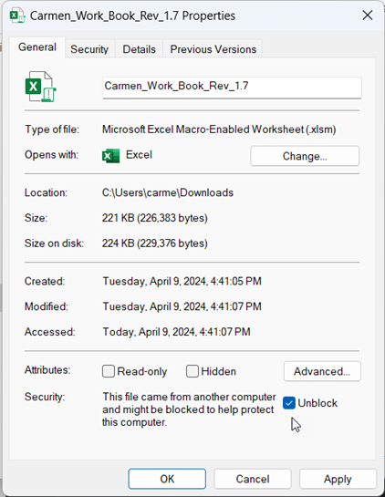

# Carmen Add-in

Carmen Add-In ใช้สำหรับการส่งและรับข้อมูลจากระบบผ่าน Excel โดยมีความสามารถเบื้องต้นดังนี้

- เรียกรายงานต่าง ๆ ผ่าน Excel เช่น Financial Statement (งบการเงิน) เช่น Balance Sheet, P&L, Daily Revenue, Trial Balance, AP Aging, AR Aging, Account Detail

- Upload Transaction เข้าระบบ เช่น JV และ Budget ด้วย Carmen Workbook

## ความต้องการพื้นฐานของเครื่อง Client (System requirement)

- ระบบ Windows ต้องเป็น Windows 8 หรือใหม่กว่า

- MS-Office version 2016 หรือใหม่กว่า

ขั้นตอนการติดตั้ง Installation

ขั้นตอนการติดตั้ง API สำหรับ Carmen Add In ขอยกตัวอย่างจากระบบ sale demo

https://saledemo.carmen.blue/

## การติดตั้ง Carmen Add in

1.1 Download Excel Add-In จาก URL ของลูกค้าตามด้วย /carmen.api

https://saledemo.carmen.blue/carmen.api

1.2 Download Excel Add-In x32 หรือ x64 (32/64 Bit ขึ้นอยู่กับ Windows ของลูกค้า)

1.3 Double Click ไฟล์ที่ download มา 
กด Install และดำเนินตามขั้นตอนจนเสร็จสิ้น

## การติดตั้ง Application Configuration

2.1 Download Application Configuration จาก URL ของลูกค้าตามด้วย /carmen.api
https://saledemo.carmen.blue/carmen.api

2.2 Download Application Configuration x32 หรือ x64 (32/64 Bit ขึ้นอยู่กับ Windows ของลูกค้า)

2.3 Double Click ไฟล์ที่ download 

2.4 กด Run เพื่อเริ่มติดตั้งจนแล้วเสร็จ

## การตั้งค่า Security ของ Excel

3.1 เปิดโปรแกรม Excel > File > Options

3.2 Click ที่ Trust Center > Trust Center Settings

3.3 ตั้งค่า Macro

- Macro Settings > Enable VBA macros
- ติ๊กถูก Enable Excel 4.0 macros when VBA macros are enabled
- กด OK เพื่อเสร็จสิ้นการตั้งค่า Macro

3.4 กด OK เพื่อเสร็จสิ้นการตั้งค่า Trust Center ของข้อ 3.2

## การตั้งค่า Add-In ใน Excel

4.1 เพิ่ม Carmen Add-In โดยไปที่ Excel > File > Options > Add-Ins

4.2 Manage Excel Add – ins กด Go

4.3 ติ๊กถูก Carmen Excel Add-In และกด OK เพื่อเสร็จสิ้นการตั้งค่า

## การตั้งค่าไฟล์ Excel ที่ใช้กับ Carmen Add-In

5.1 Click ขวาที่ไฟล์ Excel > Properties

5.2 ติ๊กถูก Unblock

5.3 กด Apply

5.4 กด OK เพื่อเสร็จสิ้น

## การตั้งค่า Carmen Add-In เพื่อเชื่อมต่อข้อมูลลูกค้า

6.1 เปิดไฟล์ Excel และ click ที่ Tab “Carmen Add-In”
หลังจาก Install Excel Add-In x64 จะมีเมนู Carmen Add-In ปรากฏขึ้นบน Excel

6.2 Click “Config WebAPI” เพื่อเชื่อมต่อข้อมูลลูกค้า

6.3 เชื่อมต่อข้อมูลของลูกค้า (เพื่อความปลอดภัย ขอให้ติดต่อ support เพื่อสอบถามรายละเอียดเพิ่มเติม)

6.4 ทดสอบ Connection โดยการกด Login

6.5 กรอก username และ password ที่ใช้เข้าระบบ Carmen

6.6 กด Login เพื่อเริ่มใช้งาน Carmen Add-In

## การตรวจสอบชื่อ Business Unit (BU)

7.1 กด Recalculate All Sheets เพื่อ update ข้อมูล

7.2 เมื่อเปิด sheet ชื่อ Parameters จะแสดงรายชื่อ BU ที่สามารถใช้งานได้ (ขึ้นอยู่กับ user permission ว่าสามารถเข้าถึง BU ใดบ้าง)

## การกำหนด Business Unit (BU) เพื่อเริ่มใช้งาน

ในการ upload ข้อมูลเข้าระบบจะต้องมีการกำหนด BU ก่อนใช้งาน

8.1 เปิด sheet ชื่อ “Intro” เพื่อกำหนดชื่อ BU (ดูชื่อ BU ได้จาก sheet ชื่อ Parameters)

8.2 กด Refresh เพื่อ update ข้อมูล

